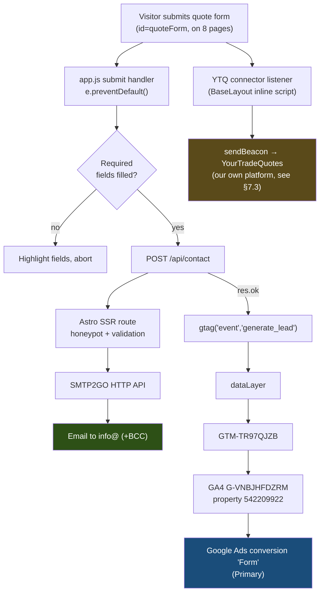
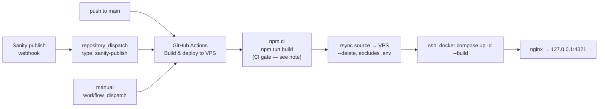

# Architecture — Surrey Contracting

Reference document for how this site is built, deployed, and instrumented.
Written to be read cold, months later, by someone who has forgotten the details.

**Live site:** https://surreycontracting.co.uk
**Repo:** `edlaycock/surrey-contracting-astro` · deploys from `main`
**Last reviewed:** 2026-07-16

---

## 1. What this is

A marketing/lead-generation site for a Surrey groundworks and civils contractor.
It is a statically generated Astro site with **one** server-rendered API route
(the contact form handler). Case-study content comes from Sanity CMS at build
time. Leads arrive by email; conversions are tracked through GTM into GA4 and
imported into Google Ads.

The business goal shapes the architecture: **the contact form must never break.**
Email delivery is server-side and independent of analytics, consent, or any
client-side JavaScript beyond the fetch itself.

---

## 2. Stack

| Layer | Choice | Notes |
|---|---|---|
| Framework | Astro `^6.4.3` | `type: module`, Node `>=22.12.0` |
| Adapter | `@astrojs/node` (standalone) | Server bundle, but only one route uses it |
| CMS | Sanity (`@sanity/client` v7) | Build-time reads only; studio in `studio/` |
| Styling | Single hand-written `public/styles.css` | ~2,800 lines, no framework, no build step |
| Client JS | Single `src/scripts/app.js` | ~260 lines, vanilla, no framework |
| Email | SMTP2GO HTTP API | Called server-side from `/api/contact` |
| Sitemap | `@astrojs/sitemap` | Excludes `/training-manual` and `/lp/*` |
| Runtime | Docker (`node:22-slim`) behind nginx | On a Hostinger VPS |
| CI/CD | GitHub Actions → rsync → `docker compose` | See §8 |

There is **no** React/Vue/Svelte, no Tailwind, no bundled CSS pipeline, and no
client-side router. Pages are HTML; `styles.css` and `app.js` are served as-is.

---

## 3. Repository layout

```
src/
  layouts/BaseLayout.astro    Every page wraps in this. Head, consent, GTM,
                              nav/footer, and the YTQ connector (§7.3) live here.
  components/
    Nav.astro                 Desktop nav + mobile drawer
    UtilityBar.astro          Top strip: strapline + phone number
    Footer.astro
    ServiceSchema.astro       Emits Service + LocalBusiness JSON-LD
  pages/
    index.astro               Homepage
    services|sectors|projects|about|health-safety|contact.astro
    groundworks|earthworks|surfacing|demolition.astro   Service pages
    projects/[slug].astro     Case study detail (Sanity-driven, getStaticPaths)
    lp/*.astro                6 paid-ad landing pages (noindex, §5.2)
    privacy|cookies.astro
    api/contact.ts            THE ONLY SSR ROUTE (prerender = false)
  lib/sanity.ts               Sanity client, queries, image URL builder
  scripts/app.js              All client interactivity + analytics events
public/
  styles.css                  The entire stylesheet
  assets/img/                 ~29 images, served directly (no Astro image opt.)
  robots.txt, llms.txt, favicons
  training-manual/            Static client training pages
studio/                       Sanity Studio (separate package, deployed separately)
deploy/nginx.conf             VPS reverse-proxy config (reference copy)
Dockerfile, docker-compose.yml
.github/workflows/deploy.yml  The whole CI/CD pipeline
```

Root also holds a number of historical audit/planning markdown files
(`FULL-AUDIT-REPORT.md`, `SEO-FIXES-TODO.md`, `ACTION-PLAN.md`, etc.). These are
point-in-time notes, not live documentation — treat them as archive.

---

## 4. Rendering model

**Static by default, server-rendered by exception.**

`astro.config.mjs` sets the Node adapter in `standalone` mode, so the build emits
both a static `dist/client/` and a server entry `dist/server/entry.mjs`. Every
page is prerendered to HTML at build time. Only `src/pages/api/contact.ts`
opts out:

```ts
export const prerender = false;   // so SMTP2GO_API_KEY stays server-side
```

The running Node process therefore serves static files for ~99% of requests and
executes real server code only for `POST /api/contact`.

**Why this matters:** content changes require a rebuild+deploy. There is no
runtime CMS fetch. A Sanity publish triggers a rebuild via webhook (§8.2).

Other config of note:

- `trailingSlash: 'never'` — nginx also strips trailing slashes (§9)
- `security.checkOrigin: false` — origin check disabled for the form POST
- 10 legacy `/project-*` URLs are 301-redirected to `/projects/*`

---

## 5. Routing & pages

### 5.1 Public pages
Standard marketing set: home, services (+4 service detail pages), sectors,
projects (index + Sanity-driven detail), about, health & safety, contact,
privacy, cookies.

### 5.2 Paid-ad landing pages (`/lp/*`)
Six pages — `groundworks`, `earthworks`, `surfacing`, `drainage`, `demolition`,
`agricultural` — built for Google Ads traffic. They differ from normal pages:

- `<meta name="robots" content="noindex,follow">` — kept out of organic index
- Excluded from the sitemap
- Carry a sticky mobile CTA bar (`.lp-sticky-cta`, driven by `app.js`)
- Their forms set `data-lead-source="lp_<service>"`, which flows into the
  `generate_lead` analytics event as `event_label` (§7.2)

This is deliberate: ad landing pages should not compete with service pages in
organic search, but should still pass link equity (`follow`).

---

## 6. Content: Sanity CMS

`src/lib/sanity.ts` is the only integration point.

- **Project:** `mhqgpyb9`, dataset `production`, API version `2024-10-01`
- **`useCdn: true`** — build-time reads hit the CDN; the publish webhook fires
  the rebuild, by which point the CDN is current
- Two queries: `getProjects()` (list) and `getProject(slug)` (detail + gallery + body)
- Case-study rich text is Portable Text, rendered via `@portabletext/to-html`

**Failure behaviour is deliberately soft.** Both queries are wrapped in
try/catch with an 8-second `AbortSignal.timeout`, and return `[]` / `null` on
failure with a console warning. There is also a `SANITY_DISABLE=1` escape hatch.

> The build will **never** fail because Sanity is down or slow — it will quietly
> ship a site with no case studies. If the projects page looks empty after a
> deploy, check the build log for `[sanity] getProjects failed` before assuming
> the CMS content was deleted.

The Studio (`studio/`) is a separate npm package with its own lockfile and is
deployed independently of this site.

---

## 7. Lead capture & instrumentation

This is the most important subsystem and the one with the most moving parts.
There are **three** independent things that happen when someone submits a quote
form. Understanding that they are independent is the key to debugging.



### 7.1 The email path (the one that matters)

`src/pages/api/contact.ts`:

1. Parses `FormData`; returns 400 on malformed input
2. **Honeypot** — a hidden `_honeypot` field; if filled, returns `{ok:true}`
   without sending (silently absorbs bots)
3. Validates `name` + `email` present, and email against a simple regex
4. Sends via the **SMTP2GO HTTP API** (not SMTP) with a 12s timeout
5. Recipients: `CONTACT_TO` (default `info@surreycontractinggroup.co.uk`),
   BCC `elaycock@cumulusdigital.co.uk`, `Reply-To` set to the enquirer
6. Returns 503 if `SMTP2GO_API_KEY` is unset, 502 if the send fails

Because this is server-side, **leads are unaffected by cookie consent, ad
blockers, or analytics failures.** If tracking shows zero conversions but emails
are arriving, the tracking is broken — not the form.

All eight forms across the site share `id="quoteForm"` and post here.

### 7.2 The analytics path

Client events are fired from `src/scripts/app.js` into the dataLayer via `gtag`:

| Event | Trigger | Location |
|---|---|---|
| `generate_lead` | Successful form POST only (inside the `res.ok` branch) | `app.js:181` |
| `phone_click` | Any `tel:` link click (delegated listener) | `app.js:209` |
| `email_click` | Any `mailto:` link click | `app.js:211` |

`generate_lead` carries `event_label` (from `data-lead-source`, defaulting to
`quote_enquiry`) and `form_id`, so ad landing-page leads are attributable to the
specific page.

The chain, end to end:

```
app.js gtag() → dataLayer → GTM-TR97QJZB → GA4 (G-VNBJHFDZRM, property 542209922)
              → GA4 key event → Google Ads imported conversion "Form" (Primary)
```

GTM container contents are **not in version control.** Tags/triggers live only
in the GTM UI. As of the last audit the container held: GA4 base tag
(Initialization – All Pages), Conversion Linker (All Pages), CookieYes CMP,
and GA4 event tags for `generate_lead` / `phone_click` / `email_click` on
matching Custom Event triggers.

Google Ads conversion actions:

- **`Form`** — GA4 import of `generate_lead`. **Primary.** The real one.
- **`phone_click`** — GA4 import. Secondary.
- **`SUBMIT_LEAD_FORM`** — legacy GA4 import of `conversion_event_submit_lead_form`.
  **Nothing in the current codebase fires that event.** Demoted to Secondary to
  stop it double-counting against `Form`. Left in place to preserve history.
- `Lead form - Submit` (Google-hosted in-ad lead forms) and
  `Local actions - Directions` — unrelated to the website form.

`email_click` is wired but **dormant — there is no `mailto:` link anywhere on
the site** for it to fire from.

### 7.3 The YourTradeQuotes (YTQ) connector

**YourTradeQuotes is our own product** — an in-house lead platform built for
trades, not an external vendor. This connector is a first-party integration that
mirrors website enquiries into it, giving a second delivery path alongside email.

`BaseLayout.astro` ends with an inline "YourTradeQuotes Enquiry Connector"
script. On submit of any `form[data-ytq-form]` it scrapes every input, textarea,
and select in the form and `sendBeacon`s the JSON to:

```
https://europe-west2-yourtradequotes.cloudfunctions.net/submitEnquiry
apiKey: 'ytq_live_demo_key_12345'
```

Because this is operational lead delivery to our own system — processing the
enquiry the visitor is actively submitting — it sits outside the CookieYes
consent gate by design. Cookie consent governs analytics/advertising storage,
not the handling of a submitted enquiry. It should still be named in the privacy
policy as a destination for enquiry data.

Two implementation details worth knowing:

- **It fires on the raw `submit` event**, so it sends *before* client-side
  validation runs and regardless of whether `/api/contact` succeeds. Half-filled
  or failed submissions will therefore still reach YTQ. Whether that's desirable
  (capturing abandoned enquiries) or noise (junk records) is a product call — but
  it does mean YTQ record counts will not reconcile with email lead counts.
- **Confirm the API key is the production one.** `ytq_live_demo_key_12345` reads
  ambiguously — `ytq_live_` suggests live, `demo_key_12345` suggests a
  placeholder. If it is a demo key, enquiries may not be landing in YTQ at all.
  Worth verifying against the YTQ dashboard.

The key is visible in client-side source, which is expected for a public
enquiry-submission endpoint, but it means the endpoint should treat it as a
public write key and rate-limit/validate accordingly rather than as a secret.

---

## 8. Deployment pipeline



### 8.1 Triggers
`.github/workflows/deploy.yml` runs on:
- `push` to `main`
- `repository_dispatch` type `sanity-publish` (client publishes content)
- manual `workflow_dispatch`

Concurrency group `deploy-<ref>` with `cancel-in-progress: true`, so rapid
pushes don't race.

### 8.2 Steps
1. Checkout, Node 22 with npm cache
2. `npm ci` then `npm run build` (with the public Sanity env vars inlined)
3. **Rsync source** to `DEPLOY_PATH` with `-avzr --delete`, excluding `.git`,
   `node_modules`, `dist`, `.astro`, `studio`, and `.env`
4. SSH in and run `docker compose up -d --build`, then `docker compose ps`

Steps 3–4 are guarded by `if: env.SSH_HOST != ''`, so the workflow degrades to a
build-only check if deploy secrets are absent.

> **Note the build happens twice.** The runner builds (step 2) but `dist` is
> explicitly *excluded* from the rsync — the image is rebuilt from source on the
> VPS by `docker compose --build`. The runner build is effectively a **CI gate**:
> it fails the workflow before anything ships if the site doesn't compile. Don't
> "optimise" it away without replacing that safety net.

> `--exclude=.env` is load-bearing. `--delete` would otherwise wipe the
> server-only secrets file on every deploy.

### 8.3 Required GitHub secrets
`SSH_HOST`, `SSH_USER`, `SSH_KEY`, `DEPLOY_PATH`.

---

## 9. Runtime topology

```
Internet
  → nginx (VPS, ports 80/443, TLS via certbot)
      · www.surreycontracting.co.uk → 301 → apex
      · trailing slash → 301 → non-slash
      → proxy_pass http://127.0.0.1:4321
          → Docker container "surrey-contracting"
              node:22-slim, node dist/server/entry.mjs
```

The container (`docker-compose.yml`) binds **only** to `127.0.0.1:4321`, joins
no shared network, mounts no shared volumes, and touches neither 80 nor 443 —
it is deliberately isolated so it can coexist with other sites on the VPS.
`restart: unless-stopped`. Secrets come from `env_file: .env` on the server.

`Dockerfile` is a two-stage build (build → runtime) copying `node_modules`,
`dist`, and `package.json` into the runtime image.

---

## 10. Environment & secrets

| Variable | Where | Purpose |
|---|---|---|
| `SMTP2GO_API_KEY` | VPS `.env` only | Email send. Never in git. |
| `CONTACT_TO` | VPS `.env` | Enquiry recipient |
| `CONTACT_FROM` | VPS `.env` | Sender (domain must be SMTP2GO-verified) |
| `PUBLIC_SANITY_PROJECT_ID` | Build-time (Actions + Dockerfile default) | Public |
| `PUBLIC_SANITY_DATASET` | Build-time | Public |
| `SANITY_DISABLE` | Optional | `=1` skips all CMS fetches |

`src/pages/api/contact.ts` reads via a helper that checks `process.env` first,
then `import.meta.env`, so it works under both Node runtime and Astro build.

See `.env.example` for the template.

---

## 11. Privacy & consent

- **Consent Mode v2 defaults to denied** in `BaseLayout.astro`'s `<head>`,
  before GTM loads: `analytics_storage`, `ad_storage`, `ad_user_data`,
  `ad_personalization` all `denied`, with `wait_for_update: 500`.
- **CookieYes** is the single CMP, loaded *via the GTM container* (it is not in
  the codebase). It updates consent to granted when the visitor accepts.
- Verified behaviour: GA requests carry `gcs=G100` (denied) before accept and
  `gcs=G111` (granted) after, persisting across navigation.

> **History:** the site previously ran *two* consent mechanisms — a custom
> `CookieBanner.astro` using `localStorage.sc_consent`, **and** CookieYes via
> GTM. Visitors saw two banners and the signals could conflict. The custom
> banner was removed (PR #2); the default-denied baseline was kept. **Do not
> re-add a code-side banner** — CookieYes owns consent now.

Scope note: consent here governs analytics and advertising storage. The YTQ
connector (§7.3) and the `/api/contact` email path are operational lead
handling — processing an enquiry the visitor chose to submit — so neither is
consent-gated. Both should be named in the privacy policy as destinations for
enquiry data.

---

## 12. SEO

- Canonical URLs, OG tags, and per-page meta are centralised in `BaseLayout`
- `ServiceSchema.astro` emits `Service` + `LocalBusiness` JSON-LD; service and
  `/lp` pages also emit FAQ schema
- Sitemap auto-generated, excluding `/training-manual` and `/lp/*`
- `/lp/*` pages are `noindex,follow`
- `public/llms.txt` present for AI crawlers
- Legacy `/project-*` URLs 301 to `/projects/*` via config redirects

---

## 13. Known drift & watch-outs

Honest list for whoever reviews this next.

1. **`DEPLOY.md` is partly stale.** It documents a PM2 + `releases/<sha>` +
   symlink deploy with `pm2 reload`. The actual pipeline is rsync +
   `docker compose up -d --build`. The VPS prerequisites and secrets table are
   still accurate; the PM2 mechanics are not.
2. **`README.md` is the untouched Astro starter template.** It describes nothing
   about this project.
3. **`nodemailer` + `@types/nodemailer` are unused dependencies.** The contact
   route calls the SMTP2GO HTTP API via `fetch`. Safe to remove.
4. **GTM container config is not in version control** and cannot be reviewed
   from this repo. Changes there are invisible to git history.
5. **`email_click` is dead code** until a `mailto:` link exists on the site.
6. **`SUBMIT_LEAD_FORM`** in Google Ads imports an event nothing fires. It is
   demoted to Secondary; delete it once confirmed flat at zero.
7. **YTQ connector API key** — `ytq_live_demo_key_12345` may be a leftover demo
   key. If so, enquiries aren't reaching YourTradeQuotes. Verify against the YTQ
   dashboard (§7.3). Separately, the connector fires pre-validation, so YTQ
   record counts won't reconcile with email lead counts.
8. **`security.checkOrigin: false`** disables Astro's CSRF origin check. The
   form's protection is the honeypot plus server-side validation.
9. Root-level audit markdown files are historical, not current.

---

## 14. Runbook

**Local dev**
```bash
npm install
npm run dev          # localhost:4321
npm run build        # full production build
npm run preview
```

**Deploy** — merge to `main`. That's it; Actions handles the rest. Watch the
run under the repo's Actions tab. A deploy takes ~90 seconds.

**Content change (case studies)** — client publishes in Sanity Studio; the
webhook fires `repository_dispatch` and the site rebuilds. No developer action.

**Add an image** — drop it in `public/assets/img/` and reference it as
`/assets/img/<name>`. Images are served as-is; there is no image optimisation
pipeline, so size them before committing.

**Debugging a "lead didn't track" report**
1. Did the **email** arrive? If yes, the form works — this is a tracking issue only.
2. Did the visitor **accept cookies**? If not, there is legitimately no
   click-level attribution (`gclid` needs `ad_storage`).
3. Check GA4 **Realtime/DebugView** with a test submission.
4. Remember GA4 → Ads conversion sync lags by hours to a day.

**Debugging an empty projects page** — check the build log for
`[sanity] getProjects failed`. The build fails soft (§6).
